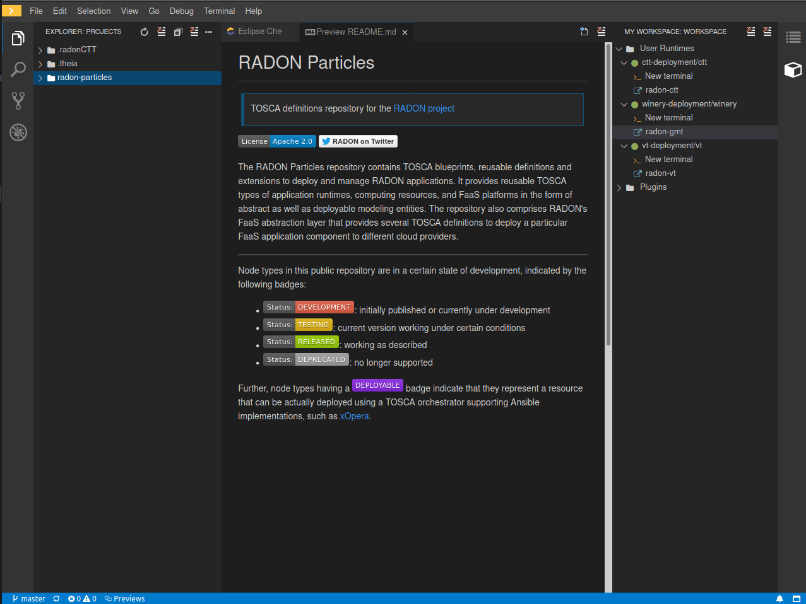
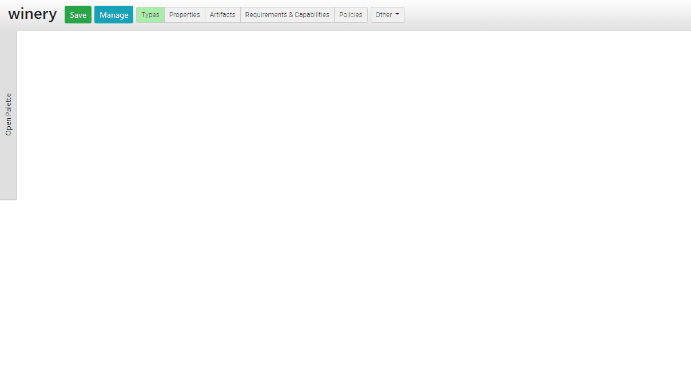
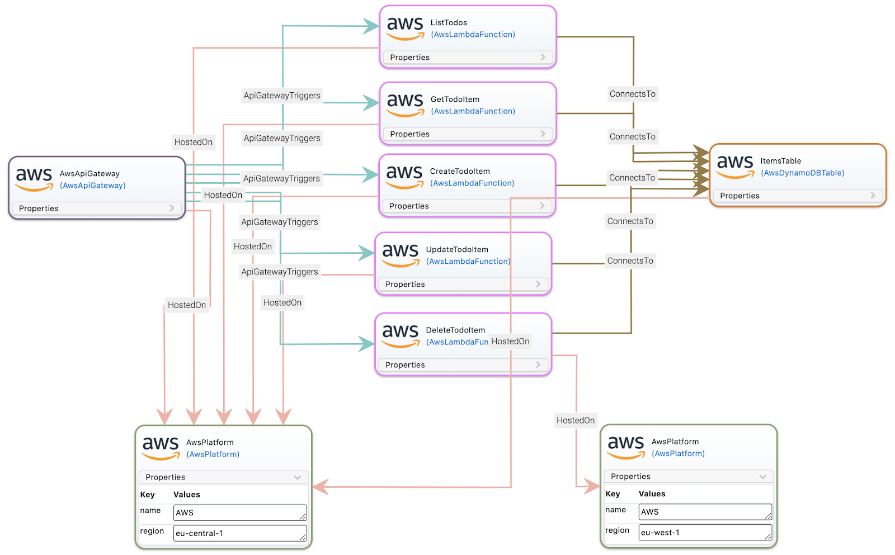

# IDE and Graphical modeling tool

The RADON development environment is based on the
[Eclipse Che](https://www.eclipse.org/che/)
technology: an open source developer workspace
server which comes with a cloud integrated
development environment (IDE) used by developers
to create applications without the need to install
any software on their local system.

> In order to get access to the RADON IDE, the
> user has to make a RADON Access Request using
> the form provided under “TEST RADON” available
> at the [RADON website](https://radon-h2020.eu/).
> A more comprehensive documentation on the RADON
> IDE can be found in the IDE
> [ReadTheDocs webpage](https://radon-ide.readthedocs.io/en/latest/).

The RADON IDE will have all the tools needed to
develop, model, orchestrate and deploy serverless
functions, through its various components shown in
the picture below:

In this workshop, we will try out a subsection of
all the different tools available.

## The IDE

### Tasks

- Login to the environment through the
  [Website](http://che-che.217.172.12.178.nip.io/)
- In the dashboard select `Get Started` tab and
  then `Custom Workspace`.
- Copy the URL of the
  [RADON Devfile available here](https://raw.githubusercontent.com/radon-h2020/radon-ide/master/devfiles/radon/v0.0.4/devfile.yaml)
  and paste it in the field URL of devfile under
  Devfile section.
- Then click on `Load devfile`
- once the RADON devfile has been loaded click on
  the `Create & Open button`

After the workspace have been created you will be
greeted with the following screen (here in dark
mode):

!!!XXX!!! HOW TO LOAD IN THE FUNCTIONS!

## Graphical Modeling Tool

Taken from the
[documentation](https://radon-ide.readthedocs.io/en/latest/):

> It enables the users to create, develop, and
> model TOSCA service templates (i.e. RADON
> models), representing the applications that are
> deployed using the RADON Orchestrator. The GMT
> is able to interact with files and folders from
> the “modeling project” inside the underlying Che
> workspace. It offers also the feature to package
> and save a CSAR of a selected RADON Model to the
> workspace in order to give the possibility to
> process it using other RADON tools or deploy it
> using the RADON Orchestrator.

All the nodes represent different entities for
that provider, being cloud provider or tool
specifics.

All the necessary nodes can be found under the
namespace “radon.nodes.aws” at the palette In the
case of AWS, all the entities we need is present:

- Api gateway
- Lambda functions
- DynamoDB
- AWS Platform

In the picture below, you can see how

After running the rest of this lab, you will have
a model that looks similar to this one:

### Tasks

- Open up GMT in the right hand side of the IDE
- Create a new 

- Model all the different nodes we need

## Node Properties

Having the nodes without specific properties will
not help us much, so we need to input the right
configuration for this to work. On the tab
properties we populate the different properties.
GMT provides a real time error detector to prevent
the user from filing false entries.

## Adding the code

- !!!XXX!!! "add artifact" with URL from
  Cloudstash
- Under properties, write the ID of the artifact
  that you pointed towards

## Node relationships

All nodes have some capabilites they offer and
some requirements they need from others.

As an example the requirement of the
AwsLambdaFunction node “HostedOn” has to be
matched with the capability of AwsPlatform node
“Host”.

In the end

### Tasks

The requirement of the AwsLambdaFunction node
“HostedOn” has to be matched with the capability
of AwsPlatform node “Host”. The requirement of the
AwsLambdaFunction node “ConnectsTo” has to be
matched with the capability of the DynamoDBTable
node “Database”.
