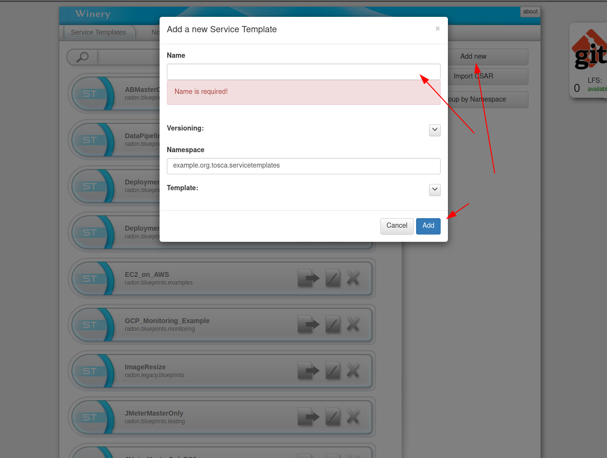

# Graphical Modeling Tool

Taken from the [documentation](https://radon-ide.readthedocs.io/en/latest/):

> It enables the users to create, develop, and model TOSCA service templates (i.e., RADON models), representing the applications that will be deployed using the RADON Orchestrator.
> The GMT is able to interact with files and folders from RADON IDE's "modeling-project".
> It offers also the feature to create and export a TOSCA CSAR file of a selected RADON Model to the Eclipse Che workspace to process it using other RADON tools or deploy it using the RADON Orchestrator.

You use the tool as an usability layer on top to maintain your TOSCA files in a graphical and intuitive user interface.
The graphical web-editor can be used to represent the different nodes, and their dependencies, that should be deployed using RADON's TOSCA orchestrator.
Thereby, GMT stores all TOSCA entities in a defined folder structure, which is accessible through the RADON IDE (modeling-project).

The example application is based on AWS and different modeling entities used for the AWS cloud provider.

All the necessary nodes can be found under the namespace `radon.nodes.aws` at the palette on the left.
In our example, all the entities we need are available:

- API Gateway
- Lambda functions
- DynamoDB table
- AWS Platform

The animation below shows how to model the different nodes:


After running the rest of this lab exercise, you will have a model that looks similar to this one:


---

## Create a new Service Template

### Tasks

- Open GMT from the workspaces tab on the right-hand side of the RADON IDE (`radon-gmt` button).
- Create a new TOSCA Service Template, as shown in the screenshot below:
  
- Give it a name (e.g., `serverless-todo`) and click `Add`.
- In the new view, click on the `Topology Template` tab, and click `Open Editor`.

---

## Node Types

All the necessary TOSCA node types can be found under the namespace `radon.nodes.aws` at the palette.
The ServerlessToDoListAPI application consists of the following node types:

- 1 AwsApiGateway
- 5 AwsLambdaFunction
- 1 AwsDynamoDBTable
- 1 AwsPlatform

### Tasks

- Model all the different nodes we need by dragging them into the canvas from the left pane

---

## Node Properties

Having the nodes without specific properties will not help us much, so we need to input the correct configuration for this to work.
By selecting a node, the edit pane can be used to populate the different properties.
GMT provides a real time error detection to prevent the user from filing false entries.

### Tasks

Populate all the nodes with the correct properties:

<details>
  <summary>AwsPlatform</summary>

```
displayName: "AwsPlatform"
properties:
  name: "AWS"
  region: "eu-central-1"
```

</details>

<details>
  <summary>AwsAPIGateway</summary>

```
displayName: "AwsApiGateway"
properties:
  api_title: "ServerlessToDoListAPI"
  api_version: "1.0.0"
  api_description: "a simple serverless API example"
```

</details>

<details>
  <summary>AwsDynamoDBTable</summary>

```
displayName: "ItemsTable"
properties:
  hash_key_name: "id"
  read_capacity: 1
  write_capacity: 1
  hash_key_type: "STRING"
  name: "items"
```

</details>

<details>
  <summary>AwsLambdaFunction (get)</summary>

```
displayName: "GetTodoItem"
properties:
  handler: "get.handler"
  name: "get-todo"
  runtime: "nodejs10.x"
  statement_id: "get-stmt"
  zip_file: "1cea0130441318a22cee6904ea971a"
  env_vars: {"TODOS_TABLE":"items"}
```

</details>
<details>
  <summary>AwsLambdaFunction (Create)</summary>

```
displayName: "CreateTodoItem"
properties:
  handler: "create.handler"
  name: "create-item"
  runtime: "nodejs10.x"
  statement_id: "create-stmt"
  zip_file: "36f24b63abeb3a7f70a1f1ca42077e"
  env_vars: {"TODOS_TABLE":"items"}
```

</details>

<details>
  <summary>AwsLambdaFunction (list)</summary>

```
  displayName: "ListTodoItem"
      properties:
        handler: "list.handler"
        name: "list-todos"
        runtime: "nodejs10.x"
        statement_id: "list-statement"
        zip_file: "9f9fd845ed2f3b061136179467ba5f"
        env_vars: {"TODOS_TABLE":"items"}
```

</details>

<details>
  <summary>AwsLambdaFunction (update)</summary>

```
     displayName: "UpdateTodoItem"
      properties:
        handler: "update.handler"
        name: "update-item"
        runtime: "nodejs10.x"
        statement_id: "update-stmt"
        zip_file: "0b2516f89dbd44dc1bd03712e81db7"
        env_vars: {"TODOS_TABLE":"items"}
```

</details>

<details>
  <summary>AwsLambdaFunction (delete)</summary>

```
  displayName: "DeleteTodoItem"
      properties:
        handler: "delete.handler"
        name: "delete-item"
        runtime: "nodejs10.x"
        statement_id: "delete-stmt"
        zip_file: "07714624b3dd0c78502024164411a7"
        env_vars: {"TODOS_TABLE":"items"}
```

</details>

---

## Attaching the code

All the function nodes require source code attached to be useful.
On the tab `Artifacts`, the artifacts that accompany the lambda function can be attached either by uploading a file or by referencing a URL from [FunctionHub](functionhub.md).

### Tasks

- Activate the `Artifacts` view for the canvas.
- On each AWS Lambda node, attach an artifact of the type `zip` with the following URL for each:
  - Get: `http://cloudstash.io/artifact_download/1cea0130441318a22cee6904ea971a`
  - Create: `http://cloudstash.io/artifact_download/36f24b63abeb3a7f70a1f1ca42077e`
  - List: `http://cloudstash.io/artifact_download/9f9fd845ed2f3b061136179467ba5f`
  - Update: `http://cloudstash.io/artifact_download/0b2516f89dbd44dc1bd03712e81db7`
  - Delete `http://cloudstash.io/artifact_download/07714624b3dd0c78502024164411a7`
- Under properties for each node, make sure that the value corresponds with the value after `/artifact_download` in the url above.

---

## Node relationships

All nodes have some capabilities they offer and some requirements they need from others.

As an example the requirement of the AwsLambdaFunction node `HostedOn` has to be matched with the capability of AwsPlatform node `host`.
The animation below shows how to use GMT to create such relationships.


### Tasks

- For all nodes besides `AwsPlatform`, they should have a requirement relationship from their `HostedOn` to the formers `host` capability.
- For all Lambda functions, the requirement of `ConnectsTo` has to be matched with the capability of the DynamoDBTable node `database_endpoint`.
- `AwsApiGateway` needs to have a requirement relationship of `Invoker` to all Lambda functions capability `Invokable`.
  - For all of the five relationships, some properties needs to be attached, listed below:
    <details>
      <summary>Get</summary>

    ```
    properties:
      endpoint: "/todos/{id}"
      http_methods: "get"
    ```
    </details>
    <details>
      <summary>Create</summary>

    ```
    properties:
      endpoint: "/todos"
      http_methods: "post"
    ```

    </details>
    <details>
      <summary>List</summary>

    ```
    properties:
      endpoint: "/todos"
      http_methods: "get"
    ```

    </details>
    <details>
      <summary>Update</summary>

    ```
    properties:
      endpoint: "/todos/{id}"
      http_methods: "put"
    ```

    </details>
    <details>
      <summary>Delete</summary>

    ```
    properties:
      endpoint: "/todos/{id}"
      http_methods: "delete"
    ```

    </details>
- When done, click `Save`, and your model is ready to be deployed.

---

## Finishing up

At the end of this, you should have a project looking something like this:


---

## If something fails

If you got stuck, the example application has already been modelled in the service templates section called `ServerlessToDoListAPI`.

---

## Next step

Head over to [xOpera](xopera.md) section to deploy your model.
